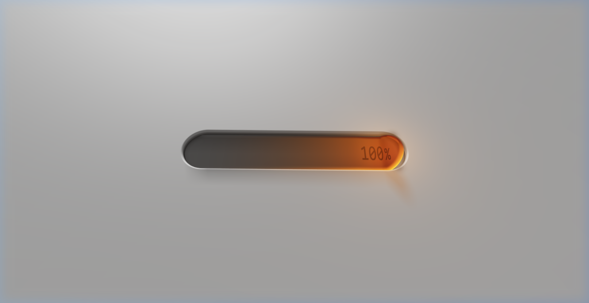

# mybuilds

Collection of experiments and interactive demos.

## Projects

### 01 — jelly-slider

Real-time 3D jelly slider rendered via GPU raymarching. SDF physics simulation with Fresnel refraction, Beer-Lambert absorption, and temporal anti-aliasing.

- Stack: TypeGPU, WebGPU, Vite, WGSL
- [Code](jelly-slider/) · [Prompt](jelly-slider/prompt.md)



### 02 — animated-login

Login form with four SVG characters that react to mouse position and form state. Real-time eye tracking, body distortion, contextual facial expressions, and a multi-phase success animation sequence.

- Stack: HTML, CSS, JavaScript (ES Modules)
- [Code](animated-login/) · [Prompt](animated-login/prompt.md)


## Structure

```
mybuilds/
├── index.html          # overview page
├── img/                # preview images
├── jelly-slider/       # webgpu raymarching demo
│   ├── main.js
│   ├── index.html
│   ├── vite.config.js
│   ├── package.json
│   └── prompt.md
└── animated-login/     # svg character login
    ├── index.html
    ├── css/
    ├── js/
    ├── img/
    └── prompt.md
```
